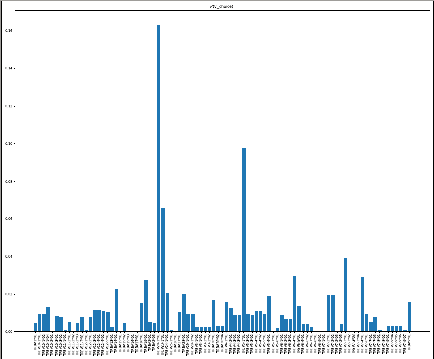

# Pygor3

Pygor3 is a python3 framework to analyze, vizualize, generate 
and infer V(D)J recombination [IGoR](https://github.com/statbiophys/IGoR) 's models. 
Pygor3 provide a python interface to execute and encapsulate 
IGoR’s input/outputs by using a sqlite3 database that 
contains input sequences, alignments, model parameters, 
conditional probabilities of the model Bayes network, 
best scenarios and generation probabilities in a single db file.
Pygor3 also has command line utilities to import/export 
IGoR generated files to [AIRR standard format](https://docs.airr-community.org/en/latest/index.html).


## Installation
1. First install IGoR in your sytem [IGoR](https://github.com/statbiophys/IGoR) if you don't have it already.
Pygor will use default IGoR's path to execute it.

2. (Optional) Install [conda](https://docs.conda.io/en/latest/) or 
[anaconda](https://www.anaconda.com/) and create (or use ) a virtual environment.

    ```bash
      $ conda create --name statbiophys python=3.7
      $ conda activate statbiophys
    ```
3. Use the package manager [pip](https://pip.pypa.io/en/stable/)
    
    ```bash
    (statbiophys) $ pip install pygor3 
    ```

## Command Line Usage

### Quickstart

#### Get demo sample data
Get a copy of demo sequences in current directory

```
$ pygor demo-get-data
```
This command creates a directory demo with the following structure

```
demo/
└── data
    └── IgL
        ├── RISQ01_01_sorted_memory_ALL_out_Nofunctional.txt
        └── RISQ01_01_sorted_naive_ALL_out_Nofunctional.txt

```

#### New Model
Now to create a model from scratch, donwload gene templates and anchors from IMGT website [IMGT](http://www.imgt.org/)
A list of available species to download from IMGT can be query with imgt-get-genomes command and option --info.

    ```bash
    $ pygor imgt-get-genomes --info
    --------------------------------
    http://www.imgt.org
    Downloading data from ... 
    List of IMGT available species:
    
    Gallus+gallus
    Cercocebus+atys
    Mustela+putorius+furo
    Macaca+nemestrina
    Vicugna+pacos
    Mus+cookii
    Bos+taurus
    Canis+lupus+familiaris
    Ornithorhynchus+anatinus
    Macaca+mulatta
    Rattus+rattus
    Mus+minutoides
    Danio+rerio
    Oncorhynchus+mykiss
    Tursiops+truncatus
    Felis+catus
    Homo+sapiens
    Salmo+salar
    Macaca+fascicularis
    Mus+musculus
    Mus+saxicola
    Capra+hircus
    Sus+scrofa
    Mus+pahari
    Ovis+aries
    Equus+caballus
    Camelus+dromedarius
    Oryctolagus+cuniculus
    Papio+anubis+anubis
    Mus+spretus
    Rattus+norvegicus
    For more details access:
    http://www.imgt.org/download/GENE-DB/IMGTGENEDB-GeneList
     
    ```

2. Download genomic templates using VJ or VDJ corresponding to the type of chain.
 
    ```console
    $ pygor imgt-get-genomes -t VDJ --imgt-species Homo+sapiens --imgt-chain TRB 
    ```

    This creates a directory **models** with the following structure will be created
    
    ```
    models/
    └── Homo+sapiens
        └── TRB
            ├── models
            └── ref_genome
                ├── genomicDs.fasta
                ├── genomicDs__imgt.fasta
                ├── genomicDs__imgt.fasta_short
                ├── genomicJs.fasta
                ├── genomicJs__imgt.fasta
                ├── genomicJs__imgt.fasta_short
                ├── genomicJs__imgt.fasta_trim
                ├── genomicVs.fasta
                ├── genomicVs__imgt.fasta
                ├── genomicVs__imgt.fasta_short
                ├── genomicVs__imgt.fasta_trim
                ├── J_gene_CDR3_anchors.csv
                ├── J_gene_CDR3_anchors__imgt.csv
                ├── J_gene_CDR3_anchors__imgt.csv_short
                ├── V_gene_CDR3_anchors.csv
                ├── V_gene_CDR3_anchors__imgt.csv
                └── V_gene_CDR3_anchors__imgt.csv_short
    
    ```

3. Create a new initial default model, with uniform distribution for the conditional probabilities
of Bayes network ("model_marginals.txt" file). Notice that in IGoR this file is called marginals,
but it is not the marginal probability of a recombination event.
    
    ```console
    $ pygor model-create -M models/Homo+sapiens/TRB/ -t VDJ
    --------------------------------
    igortask.igor_model_dir_path:  models/Homo+sapiens/TRB/
    Writing model parms in file  models/Homo+sapiens/TRB//models/model_parms.txt
    Writing model marginals in file  models/Homo+sapiens/TRB//models/model_marginals.txt
    
    ```
   
   A uniform model files will be created in files **model_parms.txt** and **model_marginals.txt** at directory path
    ```bash
    models/
    └── Homo+sapiens
        └── TRB
            ├── models
            │   ├── model_marginals.txt
            │   └── model_parms.txt
            └── ref_genome
                ├── genomicDs.fasta
                ├── genomicDs__imgt.fasta
                ├── genomicDs__imgt.fasta_short
                ├── genomicJs.fasta
                ├── genomicJs__imgt.fasta
                ├── genomicJs__imgt.fasta_short
                ├── genomicJs__imgt.fasta_trim
                ├── genomicVs.fasta
                ├── genomicVs__imgt.fasta
                ├── genomicVs__imgt.fasta_short
                ├── genomicVs__imgt.fasta_trim
                ├── J_gene_CDR3_anchors.csv
                ├── J_gene_CDR3_anchors__imgt.csv
                ├── J_gene_CDR3_anchors__imgt.csv_short
                ├── V_gene_CDR3_anchors.csv
                ├── V_gene_CDR3_anchors__imgt.csv
                └── V_gene_CDR3_anchors__imgt.csv_short
    
    ```
   
   At this point you can use a set of non-productive sequence to infer a model within IGoR directly 
   or by using pygor command.
   
    ```console
    $ pygor igor-infer -M models/Homo+sapiens/TRB/ -i sample_realizations.csv -o new_hs_trb
    ```
   This will output the following files
   ```bash
   new_hs_hb.db
   new_hs_hb_BN.pdf
   new_hs_hb_RM.pdf
   new_hs_hb_marginals.txt
   new_hs_hb_parms.txt
   ```
   where new_hs_trb.db is a database with the encapsulated information about the new model and 
   the date used by IGoR to infer it, new_hs_hb_BN.pdf is a plot of the Bayesian network(BN) of inferred
   model, new_hs_hb_RM.pdf are plots of the real marginals of events in BN, and finally the 
   new_hs_hb_parms.txt and new_hs_marginals.txt the inferred model in IGoR's format.
   
   
   
#### Model evaluation
With an inferred model we can evaluate the probability of a particular sequence to be generated (pgen) and
get the most probable scenarios for the recombination of this sequence or generate synthetic sequences.

IGoR is delivered with some default models, this models can be loaded with IGoR by using options
--species (-s) and --chain (-c)
    
```    
$ pygor model-plot -s human -c beta -o defau

or

$ pygor model-plot -M models/Homo+sapiens/TRB/ -o new_model

or 

$ pygor model-plot -D new_hs_hb.db -o new_model
```
This will output two pdf files with the Marginal Probabilities and Conditional probabilities of events





```
$pygor igor-evaluate -M -i input_sequence -o output
```
An tsv airr standard format is created with the rearragement. 

```
sequence_id	sequence	rev_comp	productive	v_call	d_call	j_call	sequence_alignment	germline_alignment	junction	junction_aa	v_cigar	d_cigar	j_cigar	v_score	v_identity	v_support	v_sequence_start	v_sequence_end	v_germline_start	v_germline_end	v_alignment_start	v_alignment_end	d_score	d_identity	d_support	d_sequence_start	d_sequence_end	d_germline_start	d_germline_end	d_alignment_start	d_alignment_end	j_score	j_identity	j_support	j_sequence_start	j_sequence_end	j_germline_start	j_germline_end	j_alignment_start	j_alignment_end	sequence_aa	vj_in_frame	stop_codon	complete_vdj	locus	sequence_alignment_aa	n1_length	np1	np1_aa	np1_length	n2_length	np2	np2_aa	np2_length	p3v_length	p5d_length	p3d_length	p5j_length	scenario_rank	scenario_proba_cond_seq	pgen	quality	quality_alignment
0	CAGTCTCCCAGGTACAAAGTCACAAAGAGGGGACAGGATGTAACTCTCAGGTGTGATCCAATTTCGAGTCATGCAACCCTTTATTGGTATCAACAGGCCCTGGGGCAGGGCCCAGAGTTTCTGACTTACTTCAATTATGAAGCTCAACCAGACAAATCAGGGCTGCCCAGTGATCGGTTCTCTGCAGAGAGGCCTGAGGGATCCATCTCCACTCTGACGATTCAGCGCACAGAGCAGCGGGACTCAGCCATGTATCGCTGTGCTAGCAGCATTCCTCGGGCTGTCAGATACGCAGTATTTTGGCCCAGGCACCCGGCTGACAGTGCTCG	F		TRBV7-7*01	TRBD2*02	TRBJ2-3*01	GGTGCTGGAGTCTCCCAGTCTCCCAGGTACAAAGTCACAAAGAGGGGACAGGATGTAACTCTCAGGTGTGATCCAATTTCGAGTCATGCAACCCTTTATTGGTATCAACAGGCCCTGGGGCAGGGCCCAGAGTTTCTGACTTACTTCAATTATGAAGCTCAACCAGACAAATCAGGGCTGCCCAGTGATCGGTTCTCTGCAGAGAGGCCTGAGGGATCCATCTCCACTCTGACGATTCAGCGCACAGAGCAGCGGGACTCAGCCATGTATCGCTGTGCCAGCAGCATTCCTCGGGCTGTCAGATACGCAGTATTTTGGCCCAGGCACCCGGCTGACAGTGCTCG		TGTGCTAGCAGCATTCCTCGGGCTGTCAGATACGCAGTATTTT		285M	4M	45M	1425			2	285	16	283			20			290	292	10	13			225			7	50	6	50		6ATTCCT		6	4	CTGT		4	0	0	0	0	1	0.02729091.34834e-19		
0	CAGTCTCCCAGGTACAAAGTCACAAAGAGGGGACAGGATGTAACTCTCAGGTGTGATCCAATTTCGAGTCATGCAACCCTTTATTGGTATCAACAGGCCCTGGGGCAGGGCCCAGAGTTTCTGACTTACTTCAATTATGAAGCTCAACCAGACAAATCAGGGCTGCCCAGTGATCGGTTCTCTGCAGAGAGGCCTGAGGGATCCATCTCCACTCTGACGATTCAGCGCACAGAGCAGCGGGACTCAGCCATGTATCGCTGTGCTAGCAGCATTCCTCGGGCTGTCAGATACGCAGTATTTTGGCCCAGGCACCCGGCTGACAGTGCTCG	F		TRBV7-7*01	TRBD2*01	TRBJ2-3*01	GGTGCTGGAGTCTCCCAGTCTCCCAGGTACAAAGTCACAAAGAGGGGACAGGATGTAACTCTCAGGTGTGATCCAATTTCGAGTCATGCAACCCTTTATTGGTATCAACAGGCCCTGGGGCAGGGCCCAGAGTTTCTGACTTACTTCAATTATGAAGCTCAACCAGACAAATCAGGGCTGCCCAGTGATCGGTTCTCTGCAGAGAGGCCTGAGGGATCCATCTCCACTCTGACGATTCAGCGCACAGAGCAGCGGGACTCAGCCATGTATCGCTGTGCCAGCAGCATTCCTCGGGCTGTCAGATACGCAGTATTTTGGCCCAGGCACCCGGCTGACAGTGCTCG		TGTGCTAGCAGCATTCCTCGGGCTGTCAGATACGCAGTATTTT		285M	4M	45M	1425			2	285	16	283			20			290	292	10	13			225			7	50	6	50		6ATTCCT		6	4	CTGT		4	0	0	0	0	2	0.02729091.34834e-19		


```


## Documentation

All the command line interface commands can be used in a python environment, like jupyter notebook, by 
exporting the pygor3 package

```python
import pygor3 as p3
mdl = p3.IgorModel(model_parms_file="model_parms.txt", model_marginals_file="model_marginals.txt")
```

For further details checkout the [documentation]() and notebooks directory.


